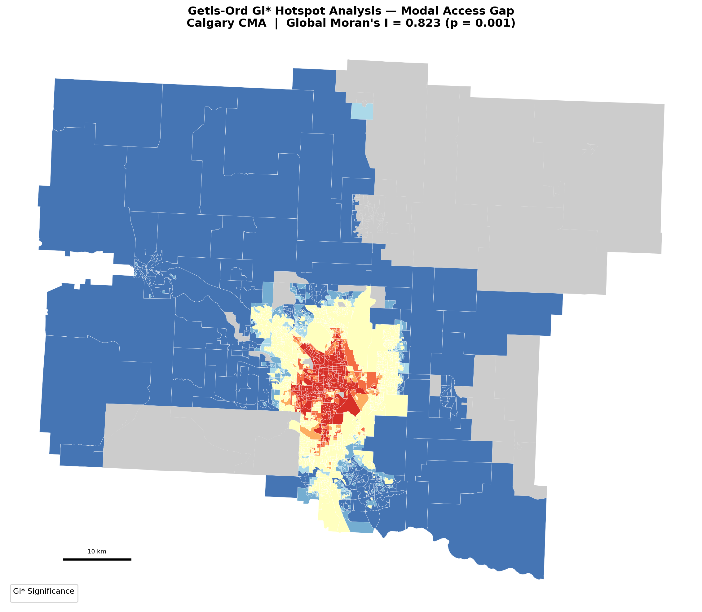
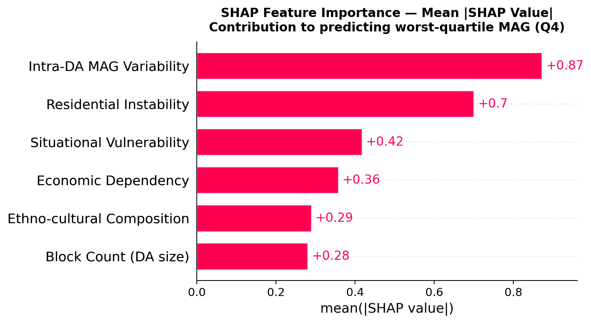

# Healthcare Access: Quantifying modal access inequality in healthcare

Most studies on healthcare accessibility ask a straightforward question: which areas have poor access to hospitals and clinics? This project asks a different one. In a city like Calgary, transit generally provides better healthcare access than walking. But that gap between what transit users can reach and what pedestrians can reach is not evenly distributed. Some areas have a large gap, others a small one. The question this project investigates is: **which socioeconomic groups are most penalized by that gap, and where are they concentrated?**

Modal Access Gap (MAG) is used in literature as a metric measuring the disparity in accessibility between private vehicles and public transport to key destinations. Here in this project, MAG is seen as the difference between a dissemination block's walking-mode and transit-peak-mode healthcare accessibility scores, both drawn from Statistics Canada's 2024 Spatial Access Measures dataset. A strongly negative MAG means transit provides substantially better healthcare access than walking in that block, so residents who cannot use transit, whether due to cost, disability, or geography, face compounded disadvantage. 

---
## Data

All data used in this project is publicly available from the Government of Canada under open data licenses.

**Statistics Canada Spatial Access Measures (SAM) 2024** — gravity-weighted accessibility indices for six transport modes (transit peak, transit off-peak, walking, and three cycling variants) across eight destination types at the dissemination block level nationally. This is the most granular national accessibility dataset ever released for Canada. The healthcare facility index (`acs_idx_hf`) is the primary variable used here. https://www150.statcan.gc.ca/n1/pub/27-26-0001/272600012023001-eng.htm 

**Canadian Index of Multiple Deprivation (CIMD) 2021** — four deprivation dimensions measured at the dissemination area level using 2021 Census microdata: residential instability, economic dependency, situational vulnerability, and ethno-cultural composition. Each dimension is available as a continuous factor score and a quintile rank. https://www150.statcan.gc.ca/n1/pub/45-20-0001/2023001/csv/can_scores_quintiles_csv-eng.zip

**2021 Census Dissemination Block boundary shapefile** — national cartographic boundary file used for all spatial operations and mapping. Dissemination area boundaries were derived by dissolving block-level geometries. https://www12.statcan.gc.ca/census-recensement/2021/geo/sip-pis/boundary-limites/index2021-eng.cfm?year=21

The study area is the Calgary Census Metropolitan Area (CMA code 825), covering approx. 11,251 dissemination blocks across 1,898 dissemination areas.

---
## Methods

**Modal Access Gap (MAG)** is computed as the per-block difference between the walking healthcare access index and the transit peak healthcare access index:
```
MAG = acs_idx_hf (walking) − acs_idx_hf (transit peak)
```
Both indices are gravity-weighted scores between 0 and 1, sharing identical facility supply inputs but differing in network impedance functions. Subtracting them isolates the modal network effect from the underlying distribution of healthcare facilities.

MAG values were aggregated from block to dissemination area level by taking the mean across constituent blocks, then joined to CIMD deprivation scores by DAUID. All spatial operations used UTM Zone 12N (EPSG:32612).

**Spatial analysis** employed Getis-Ord Gi* local spatial autocorrelation with Queen contiguity weights and 999 permutations to identify statistically significant clusters of high and low MAG. Global Moran's I was computed to characterize the overall spatial structure of the MAG distribution.

**Machine learning** used an XGBoost binary classifier to predict worst-quartile MAG membership (Q4 vs Q1–Q3) from four CIMD deprivation dimension scores plus two urban morphology features (block count and intra-DA MAG standard deviation). The transport access level features were deliberately excluded to avoid data leakage as the goal is to predict access inequality from socioeconomic characteristics, not to reconstruct MAG from its own inputs. Model performance was evaluated using 5-fold stratified cross-validation. SHAP values were computed to decompose feature contributions, with pairwise interaction values used to test for non-linear amplification effects between deprivation dimensions.

---
## Results
**The MAG distribution is universally negative across Calgary CMA.** Of 10,195 blocks with valid transit scores, 99.9% show worse walking access than transit access for healthcare facilities. The mean MAG is −0.059 (range: −0.237 to +0.065). 

**1,056 blocks (9.4%) are transit-void**: areas where Statistics Canada suppressed the transit score due to absence of service.

**The MAG distribution is strongly spatially clustered.** Global Moran's I = 0.823 (p = 0.001), indicating that access desert areas are geographically concentrated rather than randomly distributed. Gi* hotspot analysis identified 265 DAs as statistically significant hot spots at the 99% confidence level, forming a coherent ring around Calgary's inner-suburban core.

**Residential instability is the dominant socioeconomic predictor of MAG.** Spearman correlation between residential instability scores and MAG is ρ = −0.487 (p < 0.001) which is by far the strongest of the four CIMD dimensions. In the XGBoost model, residential instability ranks second in SHAP importance among deprivation features, consistent across both analytical methods.

**Economic dependency does not predict MAG** (Spearman ρ = 0.003, p = 0.886; SHAP rank 4 of 4 CIMD features). This counter-intuitive finding suggests that in Calgary, income poverty is not spatially aligned with transit-walking access differentials. Economically deprived areas are distributed across the city in ways that do not systematically coincide with the transit network's coverage pattern.

**CIMD-only model AUC = 0.725.** Deprivation dimensions alone explain a meaningful share of modal access inequality. Adding urban morphology features raises AUC to 0.817, indicating that DA-level spatial structure contributes independent predictive information beyond socioeconomic composition.

**The strongest pairwise SHAP interaction** is between residential instability and economic dependency (interaction strength = 0.092), suggesting that areas combining housing precarity with income poverty face non-linear amplification of modal access disadvantage beyond what either dimension predicts independently.

---
## Figures
| Figures | Description |
| ---- | ---- |
| `Fig1_MAG_choropleth_DB.png` | Block-level MAG map with transit-void zones |
| `Fig2_CIMD_4panel.png` | Four CIMD deprivation dimensions across Calgary CMA |
| `Fig3_bivariate_MAG_EconDep.png` | Bivariate map: MAG × economic dependency |
| `Fig4_Gi_hotspot_MAG.png` | Getis-Ord Gi* hotspot clusters of access inequality |
| `Fig5_correlation_scatter.png` | Scatter plots: each CIMD dimension vs MAG |
| `Fig6_void_zone_profile.png` | Deprivation profile of transit-void vs transit-served DAs |
| `Fig7_ROC_confusion.png` | XGBoost ROC curve and confusion matrix |
| `Fig8_SHAP_beeswarm.png` | SHAP beeswarm — all features |
| `Fig9_SHAP_bar.png` | SHAP mean absolute importance |
| `Fig10_SHAP_dependence.png` | SHAP dependence plots — top 2 features |
| `Fig11_SHAP_waterfall.png` | Individual DA explanations |
| `Fig12_SHAP_interaction_heatmap.png` | Pairwise SHAP interaction strengths |
| `Fig13_SHAP_CIMD_only_beeswarm.png` | SHAP beeswarm — deprivation features only |

---
## Limitations
The SAM 2024 assumes a uniform traveller profile: fixed walking speed, standard stop access distances, no account for terrain, disability, or trip chaining. This likely understates access deficits for elderly and mobility-impaired populations, who are captured in the situational vulnerability CIMD dimension but whose transport constraints are not fully reflected in the accessibility scores. Additionally, dissemination area aggregation of CIMD scores introduces modifiable areal unit effects that may  amplify observed correlations. The analysis is cross-sectional and cannot establish causal direction between deprivation and access inequality.

---
## Project Stage

**Paper pre-print under development** 

**will include national-level analysis**

**comparison with other ML models for ROC-AUC to be added**



